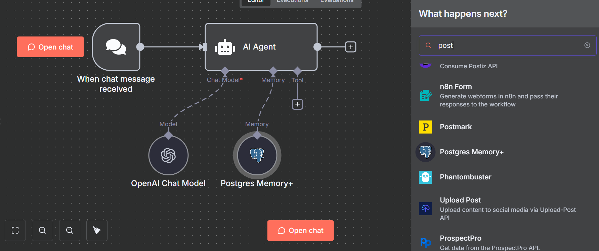

# n8n-nodes-postgres-advanced-memory

This is an n8n community node that provides advanced PostgreSQL chat memory functionality for AI agents with **schema support**.

[n8n](https://n8n.io/) is a [fair-code licensed](https://docs.n8n.io/reference/license/) workflow automation platform.

[Installation](#installation) | [Operations](#operations) | [Credentials](#credentials) | [Usage](#usage) | [Resources](#resources)

## Features

✅ **Schema Support** - Organize chat histories across different PostgreSQL schemas  
✅ **Auto Schema & Table Creation** - Automatically creates schemas and tables if they don't exist  
✅ **Session Tracking** - Optional thread management with metadata table for conversation lists  
✅ **Context Window** - Configure the number of previous messages to retain  
✅ **Session Management** - Flexible session ID management with expression support  
✅ **SSL/TLS Support** - Full SSL/TLS connection support  
✅ **Multi-version** - Supports versions 1.0, 1.1, 1.2, and 1.3

## Installation

Follow the [installation guide](https://docs.n8n.io/integrations/community-nodes/installation/) in the n8n community nodes documentation.

### npm

```bash
npm install n8n-nodes-postgres-advanced-memory
```

### n8n UI

1. Go to **Settings** > **Community Nodes**
2. Click **Install**
3. Enter `n8n-nodes-postgres-advanced-memory`
4. Click **Install**

## Prerequisites

- n8n version 1.0.0 or higher
- PostgreSQL 9.5 or higher
- Valid PostgreSQL credentials

## Operations

### Postgres Memory+

Store and retrieve chat history in a PostgreSQL database with advanced schema configuration.



#### Configuration Options

| Option                      | Type    | Default                  | Description                                                |
| --------------------------- | ------- | ------------------------ | ---------------------------------------------------------- |
| **Schema Name**             | string  | `public`                 | PostgreSQL schema where the table is located               |
| **Table Name**              | string  | `n8n_chat_histories`     | Name of the table to store chat history                    |
| **Session Key**             | string  | `={{ $json.sessionId }}` | Identifier for the chat session                            |
| **Context Window Length**   | number  | `5`                      | Number of previous messages to retain (v1.1+)              |
| **Enable Session Tracking** | boolean | `false`                  | Track sessions in separate table for thread management     |
| **Sessions Table Name**     | string  | `n8n_chat_sessions`      | Table name for session metadata (when tracking is enabled) |

## Auto-Creation Features

The node automatically creates:

1. **Schemas** if they don't exist (for non-`public` schemas)
2. **Chat history table** if it doesn't exist in the specified schema
3. **Sessions table** if session tracking is enabled and table doesn't exist

**Requirements:**

- For schema creation: Database user needs `CREATE SCHEMA` permission
- For table creation: Database user needs `CREATE TABLE` permission in the schema

**Behavior:**

- If permissions are missing, the node logs a warning but continues
- The `public` schema is never auto-created (it always exists)
- Graceful fallback if auto-creation fails

## Session Tracking (Thread Management)

Enable session tracking to maintain a separate table with conversation metadata:


**Session Table Structure:**

```sql
{
  id: string,              // Session ID (UUID)
  title: string,           // Auto-generated from first 50 chars
  lastMessage: string,     // Preview of last message
  timestamp: Date,         // Last update time
  messageCount: number,    // Total messages in session
  createdAt: Date,        // Session creation time
  updatedAt: Date         // Last modification time
}
```

**Use Cases:**

- Display list of user conversations
- Load specific conversation threads
- Sort by most recent activity
- Show message previews
- Track conversation metrics

## Credentials

This node uses the standard **n8n PostgreSQL credentials**. Configure:

- **Host**: Database server address
- **Port**: Database port (default: 5432)
- **Database**: Database name
- **User**: Database username
- **Password**: Database password
- **SSL Options**: Optional SSL/TLS configuration

## Usage

### Basic Example

1. Add the **Postgres Memory+** node to your workflow
2. Connect your PostgreSQL credentials
3. Configure the schema name (e.g., `public`, `ai_memory`, or `tenant_123`)
   - Schema will be auto-created if it doesn't exist
4. Set the table name (default: `n8n_chat_histories`)
   - Table will be auto-created if it doesn't exist
5. Configure your session key
6. Connect to an AI Agent node

### Workflow Example

```
Chat Trigger → AI Agent → Postgres Chat Memory Advanced → Send Response
```

The memory node will:

1. Connect to your specified schema and table
2. Load previous conversation history for the session
3. Provide context to the AI agent
4. Store new messages after each interaction

### Schema Organization Examples

#### Single Schema (Default)

```
Schema: public
Table: n8n_chat_histories
```

#### Multi-tenant Application

```
Schema: tenant_{{ $json.tenantId }}
Table: chat_histories
Session: {{ $json.userId }}_{{ $json.conversationId }}
```

#### Organized by Environment

```
Schema: production_ai
Table: agent_conversations
Session: {{ $json.agentId }}_{{ $json.sessionId }}
```

### With Session Tracking Example

```
Schema: public
Table: n8n_chat_histories
Session Key: {{ $json.sessionId }}
Context Window: 10
Options:
  - Enable Session Tracking: true
  - Sessions Table Name: chat_sessions
```

This creates two tables:

- `public.n8n_chat_histories` - Stores actual chat messages
- `public.chat_sessions` - Stores session metadata for thread management

## Building a Chat Interface

When session tracking is enabled, you can build a complete chat interface:

### 1. List All Conversations

```sql
SELECT
  id,
  title,
  last_message,
  timestamp,
  message_count
FROM public.n8n_chat_sessions
ORDER BY timestamp DESC
LIMIT 20;
```

### 2. Load Specific Conversation

```sql
SELECT message, created_at
FROM public.n8n_chat_histories
WHERE session_id = '{{ $json.sessionId }}'
ORDER BY created_at ASC;
```

### 3. Search Conversations

```sql
SELECT id, title, last_message, timestamp
FROM public.n8n_chat_sessions
WHERE title ILIKE '%{{ $json.searchQuery }}%'
   OR last_message ILIKE '%{{ $json.searchQuery }}%'
ORDER BY timestamp DESC;
```

## Best Practices

### Schema Organization

- Use separate schemas for different environments (dev, staging, prod)
- Consider schema-per-tenant for multi-tenant applications
- Use descriptive schema names

### Session Key Strategy

- Include user identifiers in session keys
- Consider adding conversation IDs for multiple concurrent chats
- Use delimiters (\_, -, /) for clarity

### Context Window

- Start with 5-10 messages for general conversations
- Increase to 20-50 for complex, context-heavy discussions
- Balance database size vs. context quality

### Performance

- Session tracking updates happen asynchronously (non-blocking)
- No impact on agent response time
- Connection pooling for efficiency
- Automatic indexes on frequently queried columns

### Security

- Use SSL/TLS for production connections
- Implement proper database user permissions
- Consider row-level security for multi-tenant scenarios

## Troubleshooting

### Connection Issues

- Verify PostgreSQL credentials
- Check network connectivity and firewall rules
- Ensure PostgreSQL allows connections from n8n server

### Schema Not Found

- Verify schema exists or check auto-creation permissions
- Create schema manually: `CREATE SCHEMA schema_name;`
- Check user permissions: `GRANT USAGE ON SCHEMA schema_name TO user;`

### Memory Not Persisting

- Verify session key is consistent across requests
- Check table has data: `SELECT * FROM schema_name.table_name;`
- Ensure context window is not set too low

## Performance Impact

### Agent Speed

- **Session tracking is non-blocking** - Updates happen in the background
- **No impact on agent response time** - The agent responds immediately
- **Primary memory function** - Agent uses this for conversation context
- **Metadata tracking** - Additional feature for external systems to list threads

### How It Works

```
User Message → Agent loads history (FAST) → Agent responds (FAST)
                                                   ↓
                            Session metadata updated in background (async)
```

## Comparison with Standard Node

| Feature            | Standard Node | Advanced Node |
| ------------------ | ------------- | ------------- |
| Schema Support     | ❌            | ✅            |
| Table Name         | ✅            | ✅            |
| Session Management | ✅            | ✅            |
| Thread Management  | ❌            | ✅            |
| Context Window     | ✅            | ✅            |
| Auto Schema/Table  | ❌            | ✅            |
| Performance Impact | None          | None          |

## Development

```bash
# Install dependencies
npm install

# Build the node
npm run build

# Run in development mode
npm run dev

# Lint code
npm run lint

# Fix linting issues
npm run lintfix
```

## Migration from Standard Node

To migrate from the standard Postgres Chat Memory node:

1. Install this advanced node
2. Replace the standard node with the advanced node
3. Add the schema name field (default: `public`)
4. Keep all other settings the same
5. Test thoroughly in a development environment

## Resources

- [n8n community nodes documentation](https://docs.n8n.io/integrations/community-nodes/)
- [LangChain PostgreSQL Memory](https://js.langchain.com/docs/modules/memory/integrations/postgres)

## License

[MIT](LICENSE.md)
