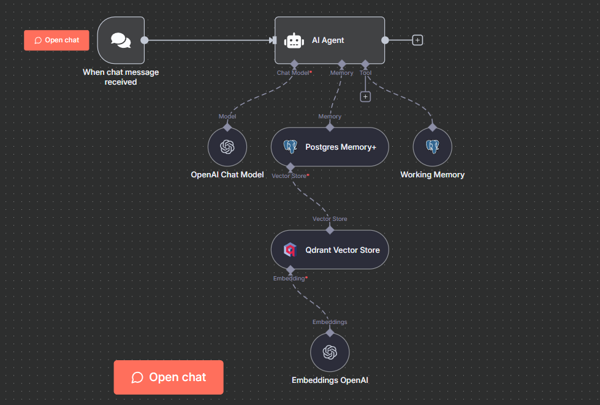

# n8n-nodes-postgres-advanced-memory

This is an n8n community node that provides advanced PostgreSQL chat memory functionality for AI agents with **schema support**.

[n8n](https://n8n.io/) is a [fair-code licensed](https://docs.n8n.io/reference/license/) workflow automation platform.

[Installation](#installation) | [Operations](#operations) | [Credentials](#credentials) | [Usage](#usage) | [Resources](#resources)

## Features

✅ **Schema Support** - Organize chat histories across different PostgreSQL schemas  
✅ **Auto Schema & Table Creation** - Automatically creates schemas and tables if they don't exist  
✅ **Session Tracking** - Optional thread management with metadata table for conversation lists  
✅ **Working Memory** - Mastra-like persistent user information across conversations  
✅ **Working Memory Tool** - Explicit tool-based memory updates for transparency (NEW!)  
✅ **Context Window** - Configure the number of previous messages to retain  
✅ **Session Management** - Flexible session ID management with expression support  
✅ **SSL/TLS Support** - Full SSL/TLS connection support  
✅ **Semantic Search** - Advanced RAG-based memory retrieval with dynamic node shape  
✅ **Token Optimization** - Minimal-token semantic context injection for efficient AI responses  
✅ **Multi-version** - Supports versions 1.0, 1.1, 1.2, and 2.0

## Screenshots

### Main Configuration



### Schema and Session Setup


## Installation

Follow the [installation guide](https://docs.n8n.io/integrations/community-nodes/installation/) in the n8n community nodes documentation.

### npm

```bash
npm install n8n-nodes-postgres-advanced-memory
```

### n8n UI

1. Go to **Settings** > **Community Nodes**
2. Click **Install**
3. Enter `n8n-nodes-postgres-advanced-memory`
4. Click **Install**

## Prerequisites

- n8n version 1.0.0 or higher
- PostgreSQL 9.5 or higher
- Valid PostgreSQL credentials

## Operations

### Postgres Memory+

Store and retrieve chat history in a PostgreSQL database with advanced schema configuration.

#### Main Configuration


#### Configuration Options

| Option                      | Type    | Default                  | Description                                                |
| --------------------------- | ------- | ------------------------ | ---------------------------------------------------------- |
| **Schema Name**             | string  | `public`                 | PostgreSQL schema where the table is located               |
| **Table Name**              | string  | `n8n_chat_histories`     | Name of the table to store chat history                    |
| **Session Key**             | string  | `={{ $json.sessionId }}` | Identifier for the chat session                            |
| **Context Window Length**   | number  | `5`                      | Number of previous messages to retain (v1.1+)              |
| **Enable Session Tracking** | boolean | `false`                  | Track sessions in separate table for thread management     |
| **Sessions Table Name**     | string  | `n8n_chat_sessions`      | Table name for session metadata (when tracking is enabled) |
| **Enable Working Memory**   | boolean | `false`                  | Enable Mastra-like persistent user information (NEW!)      |
| **Working Memory Template** | string  | (user info template)     | Markdown template for storing persistent user data         |
| **Enable Semantic Search**  | boolean | `false`                  | Enable RAG-based memory retrieval using embeddings         |
| **Top K Results**           | number  | `3`                      | Number of semantically similar messages to retrieve        |
| **Message Range**           | number  | `2`                      | Context messages before/after each semantic match          |

## Semantic Search (NEW in v2.0!)

### 🎯 Revolutionary Features

**Dynamic Node Shape** - The node automatically adapts its connection points:

- **Semantic Search OFF**: No input connections (normal memory node)
- **Semantic Search ON**: Shows Vector Store input connection

**Token-Optimized Context Injection** - Minimal overhead, maximum efficiency:

- Injects actual message objects into chat history
- Uses only ~10 tokens for demarcation markers
- 90% fewer tokens compared to traditional context injection methods

### How It Works

1. **Enable Feature**: Turn on "Semantic Search" in Options
2. **Connect Vector Store**: Attach your Vector Store node (the node shape changes automatically!)
3. **Set Context Window**: Configure your desired context window length (e.g., 10 messages)
4. **Automatic Embedding**: Messages are embedded using the vector store's internal model (non-blocking)
5. **Smart Activation**: Semantic search ONLY runs when context window is full
   - Short conversations: Uses regular memory (instant, no overhead)
   - Long conversations: Automatically retrieves relevant older messages
6. **Natural Injection**: Retrieved messages are injected as actual conversation history

### Setup Example

```
                             ┌──────────────────────────────┐
┌─────────────────┐          │  Postgres Memory+            │
│ Vector Store    │─────────>│  ┌────────────────────────┐  │
│ (with Embeddings│  When    │  │ Semantic Search: ON    │  │──> AI Agent
│  connected)     │  enabled │  │ • Vector Store Input   │  │
└─────────────────┘          │  └────────────────────────┘  │
                             └──────────────────────────────┘

When Semantic Search is OFF, the node has no input connections (normal memory shape)
```

### Configuration

| Option            | Description                                              |
| ----------------- | -------------------------------------------------------- |
| **Top K Results** | Number of similar past messages to retrieve (default: 3) |
| **Message Range** | Include N messages before/after each match (default: 2)  |

### How Context is Injected

**Optimized Format** (Minimal Tokens):

```
System: === Relevant Context from Earlier Conversation ===
Human: my name is rufaro mugabe
AI: Nice to meet you, Rufaro Mugabe!
Human: what do you do
AI: I'm an AI assistant here to help you...
System: === Current Conversation ===
Human: [current message continues...]
```

### Benefits

- 🔍 **Semantic Understanding**: Finds relevant messages even if wording differs
- 📚 **Long-term Memory**: Retrieves important context from weeks/months ago
- 🎯 **Context-aware**: Returns surrounding messages for better understanding
- ⚡ **Zero Overhead**: No performance impact when context window isn't full
- 🎯 **Smart Activation**: Only searches when there are older messages beyond recent context
- 💰 **Token Efficient**: 90% reduction in context overhead
- 🎨 **Clean UI**: Dynamic node shape based on configuration
- 🔌 **Simple Setup**: Only need Vector Store (uses its internal embedding model)
- 🚀 **Instant Detection**: Uses already-loaded messages, no extra database queries

### Supported Vector Stores

Works with any n8n vector store node:

- Postgres with pgvector
- Pinecone
- Qdrant
- Supabase
- Chroma
- Weaviate
- In-Memory Vector Store
- And more!

## Auto-Creation Features

The node automatically creates:

1. **Schemas** if they don't exist (for non-`public` schemas)
2. **Chat history table** if it doesn't exist in the specified schema
3. **Sessions table** if session tracking is enabled and table doesn't exist

**Requirements:**

- For schema creation: Database user needs `CREATE SCHEMA` permission
- For table creation: Database user needs `CREATE TABLE` permission in the schema

**Behavior:**

- If permissions are missing, the node logs a warning but continues
- The `public` schema is never auto-created (it always exists)
- Graceful fallback if auto-creation fails

## Working Memory (NEW!)

Inspired by Mastra's working memory system, this feature allows agents to maintain persistent, structured information about users across conversations.

### 🧠 What is Working Memory?

Working memory is like the agent's scratchpad - it stores long-term user information that should always be available:

- User preferences
- Personal details (name, location, etc.)
- Goals and interests
- Important facts
- Ongoing projects

### How It Works

1. **Enable Feature**: Turn on "Working Memory" in Options (requires Session Tracking)
2. **Customize Template**: Define the structure of information you want to track
3. **Automatic Injection**: Working memory is injected at the start of every conversation
4. **Agent Updates**: Agents can update working memory by using special markers
5. **Non-Blocking**: All operations are asynchronous to ensure no performance impact

### Example Usage

**Initial Template:**

```markdown
# User Information

- **First Name**:
- **Last Name**:
- **Location**:
- **Interests**:
```

**After Conversation:**

```markdown
# User Information

- **First Name**: Rufaro
- **Last Name**: Mugabe
- **Location**: Zimbabwe
- **Interests**: AI, Software Development
```

### Storage

Working memory is stored in the sessions table `metadata` column as JSONB:

```sql
metadata: {
  "workingMemory": "# User Information\n- **First Name**: Rufaro\n..."
}
```

### Agent Integration

Agents automatically receive instructions on how to update working memory. When they learn new information, they include it in their response:

```
[UPDATE_WORKING_MEMORY]
# User Information
- **First Name**: Rufaro
- **Last Name**: Mugabe
- **Location**: Zimbabwe
[/UPDATE_WORKING_MEMORY]
```

The system automatically detects and stores the update without slowing down responses.

### Benefits

- 🧠 **Persistent Memory**: Information persists across all conversations in a thread
- 🚀 **Non-Blocking**: Zero impact on response speed
- 📝 **Structured**: Markdown templates keep data organized
- 🔄 **Automatic**: Agents update memory seamlessly
- 🎯 **Contextual**: Always available to the agent for better responses

### Documentation

For detailed information, see:

- [Working Memory Documentation](nodes/MemoryPostgresAdvanced/docs/WORKING_MEMORY.md)
- [Working Memory Quickstart](docs/WORKING_MEMORY_QUICKSTART.md)

## Working Memory Tool (NEW!)

A dedicated tool node that gives AI agents explicit control over working memory through tool calls.

### 🎯 Why Use the Tool?

**Transparency & Control**:

- Tool calls are visible in logs
- Agent explicitly decides when to update
- Better debugging and monitoring
- Cleaner separation of concerns

**Two-Node Architecture**:

```
Postgres Memory+ (Read-Only)
      ↓
  AI Agent
      ↓
Working Memory Tool (Updates)
```

### Features

✅ **Explicit Updates** - Agent calls `updateWorkingMemory` tool  
✅ **Read Capability** - Optional `getWorkingMemory` tool to check current state  
✅ **Full Instructions** - Tool description includes guidelines and template  
✅ **Three Modes** - Update Only, Read Only, or Both  
✅ **Same Database** - Works with Postgres Memory+ sessions table

### Quick Setup

1. **Postgres Memory+ Node**:
   - Enable Session Tracking ✅
   - Enable Working Memory ✅
2. **Working Memory Tool Node**:
   - Same Session ID as Memory+ node
   - Same Sessions Table name
   - Tool Mode: "Update Only" (recommended)
3. **Connect both to AI Agent**

### Example

**User:** "My name is Rufaro and I love soccer"

**Agent:**

```
[Calls updateWorkingMemory tool]
Input: {
  "workingMemory": "# User Information\n- **First Name**: Rufaro\n- **Interests**: Soccer"
}

Response: "Nice to meet you, Rufaro! Soccer is a great sport."
```

### Benefits vs Automatic Updates

| Feature           | Automatic (Tags) | Tool-Based      |
| ----------------- | ---------------- | --------------- |
| Visibility        | Hidden           | Visible in logs |
| Control           | Automatic        | Explicit        |
| Debugging         | Harder           | Easier          |
| Agent reads first | No               | Yes (optional)  |
| Transparency      | Low              | High            |

### Documentation

For detailed information, see:

- [Working Memory Tool Guide](nodes/WorkingMemoryTool/docs/WORKING_MEMORY_TOOL.md)
- [Tool Quickstart](docs/WORKING_MEMORY_TOOL_QUICKSTART.md)
- [Architecture Overview](docs/WORKING_MEMORY_ARCHITECTURE.md)

## Session Tracking (Thread Management)

Enable session tracking to maintain a separate table with conversation metadata:

#### Schema and Session Configuration


**Session Table Structure:**

```sql
{
  id: string,              // Session ID (UUID)
  title: string,           // Auto-generated from first 50 chars
  lastMessage: string,     // Preview of last message
  timestamp: Date,         // Last update time
  messageCount: number,    // Total messages in session
  createdAt: Date,        // Session creation time
  updatedAt: Date         // Last modification time
}
```

**Use Cases:**

- Display list of user conversations
- Load specific conversation threads
- Sort by most recent activity
- Show message previews
- Track conversation metrics

## Credentials

This node uses the standard **n8n PostgreSQL credentials**. Configure:

- **Host**: Database server address
- **Port**: Database port (default: 5432)
- **Database**: Database name
- **User**: Database username
- **Password**: Database password
- **SSL Options**: Optional SSL/TLS configuration

## Visual Guide

### Node Configuration Examples

#### Basic Setup

The main node configuration allows you to specify schema, table name, and session settings:


#### Advanced Setup with Session Tracking

Configure schema isolation and enable session tracking for thread management:


## Usage

### Basic Example

1. Add the **Postgres Memory+** node to your workflow
2. Connect your PostgreSQL credentials
3. Configure the schema name (e.g., `public`, `ai_memory`, or `tenant_123`)
   - Schema will be auto-created if it doesn't exist
4. Set the table name (default: `n8n_chat_histories`)
   - Table will be auto-created if it doesn't exist
5. Configure your session key
6. Connect to an AI Agent node

### Workflow Example

```
Chat Trigger → AI Agent → Postgres Chat Memory Advanced → Send Response
```

The memory node will:

1. Connect to your specified schema and table
2. Load previous conversation history for the session
3. Provide context to the AI agent
4. Store new messages after each interaction

### Schema Organization Examples

#### Single Schema (Default)

```
Schema: public
Table: n8n_chat_histories
```

#### Multi-tenant Application

```
Schema: tenant_{{ $json.tenantId }}
Table: chat_histories
Session: {{ $json.userId }}_{{ $json.conversationId }}
```

#### Organized by Environment

```
Schema: production_ai
Table: agent_conversations
Session: {{ $json.agentId }}_{{ $json.sessionId }}
```

### With Session Tracking Example

```
Schema: public
Table: n8n_chat_histories
Session Key: {{ $json.sessionId }}
Context Window: 10
Options:
  - Enable Session Tracking: true
  - Sessions Table Name: chat_sessions
```

This creates two tables:

- `public.n8n_chat_histories` - Stores actual chat messages
- `public.chat_sessions` - Stores session metadata for thread management

## Building a Chat Interface

When session tracking is enabled, you can build a complete chat interface:

### 1. List All Conversations

```sql
SELECT
  id,
  title,
  last_message,
  timestamp,
  message_count
FROM public.n8n_chat_sessions
ORDER BY timestamp DESC
LIMIT 20;
```

### 2. Load Specific Conversation

```sql
SELECT message, created_at
FROM public.n8n_chat_histories
WHERE session_id = '{{ $json.sessionId }}'
ORDER BY created_at ASC;
```

### 3. Search Conversations

```sql
SELECT id, title, last_message, timestamp
FROM public.n8n_chat_sessions
WHERE title ILIKE '%{{ $json.searchQuery }}%'
   OR last_message ILIKE '%{{ $json.searchQuery }}%'
ORDER BY timestamp DESC;
```

## Best Practices

### Schema Organization

- Use separate schemas for different environments (dev, staging, prod)
- Consider schema-per-tenant for multi-tenant applications
- Use descriptive schema names

### Session Key Strategy

- Include user identifiers in session keys
- Consider adding conversation IDs for multiple concurrent chats
- Use delimiters (\_, -, /) for clarity

### Context Window

- Start with 5-10 messages for general conversations
- Increase to 20-50 for complex, context-heavy discussions
- Balance database size vs. context quality

### Performance

- Session tracking updates happen asynchronously (non-blocking)
- No impact on agent response time
- Connection pooling for efficiency
- Automatic indexes on frequently queried columns

### Security

- Use SSL/TLS for production connections
- Implement proper database user permissions
- Consider row-level security for multi-tenant scenarios

## Troubleshooting

### Connection Issues

- Verify PostgreSQL credentials
- Check network connectivity and firewall rules
- Ensure PostgreSQL allows connections from n8n server

### Schema Not Found

- Verify schema exists or check auto-creation permissions
- Create schema manually: `CREATE SCHEMA schema_name;`
- Check user permissions: `GRANT USAGE ON SCHEMA schema_name TO user;`

### Memory Not Persisting

- Verify session key is consistent across requests
- Check table has data: `SELECT * FROM schema_name.table_name;`
- Ensure context window is not set too low

## Performance Impact

### Agent Speed

**Without Semantic Search:**

- **Instant loading** - Direct database query for recent messages
- **No overhead** - Standard memory node performance

**With Semantic Search (Smart Activation):**

- **Storage is non-blocking** - Messages are embedded in the background, zero impact
- **Context window not full** - Zero overhead, instant response (uses regular memory only)
- **Context window full** - Semantic search activates (~150-800ms depending on vector store)
- **Zero-cost detection** - Uses already-loaded messages, no extra database queries
- **Token-optimized** - Minimal context overhead (90% reduction vs traditional methods)

### Performance Examples

**Example 1: New Conversation (5 messages, window size: 10)**

```
Query Time: ~50ms (regular memory only)
Semantic Search: Skipped (window not full)
Total: ~50ms ⚡
```

**Example 2: Long Conversation (100 messages, window size: 10)**

```
Query Time: ~50ms (regular memory) + ~200-500ms (semantic search)
Semantic Search: Active (retrieves relevant older messages)
Total: ~250-550ms 📚
```

### How It Works

**Without Semantic Search:**

```
User Message → Load recent history → Agent responds
```

**With Semantic Search:**

```
User Message → Load recent history + Semantic search → Agent responds
               (fast ~50ms)          (adds ~200-500ms)   (with better context)
                                           ↓
                     Background: Store embedding (non-blocking)
```

**Session Tracking (Always Non-blocking):**

```
Agent Response → Update session metadata in background (async)
```

## Comparison with Standard Node

| Feature            | Standard Node | Advanced Node |
| ------------------ | ------------- | ------------- |
| Schema Support     | ❌            | ✅            |
| Table Name         | ✅            | ✅            |
| Session Management | ✅            | ✅            |
| Thread Management  | ❌            | ✅            |
| Context Window     | ✅            | ✅            |
| Auto Schema/Table  | ❌            | ✅            |
| Performance Impact | None          | None          |

## Development

```bash
# Install dependencies
npm install

# Build the node
npm run build

# Run in development mode
npm run dev

# Lint code
npm run lint

# Fix linting issues
npm run lintfix
```

## Migration from Standard Node

To migrate from the standard Postgres Chat Memory node:

1. Install this advanced node
2. Replace the standard node with the advanced node
3. Add the schema name field (default: `public`)
4. Keep all other settings the same
5. Test thoroughly in a development environment

## Resources

- [n8n community nodes documentation](https://docs.n8n.io/integrations/community-nodes/)
- [LangChain PostgreSQL Memory](https://js.langchain.com/docs/modules/memory/integrations/postgres)

## License

[MIT](LICENSE.md)
